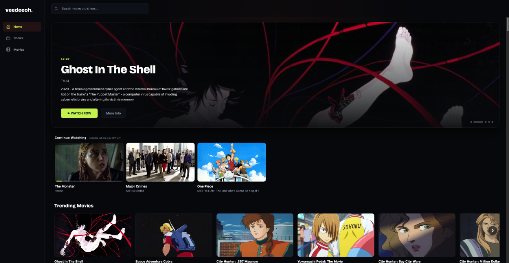
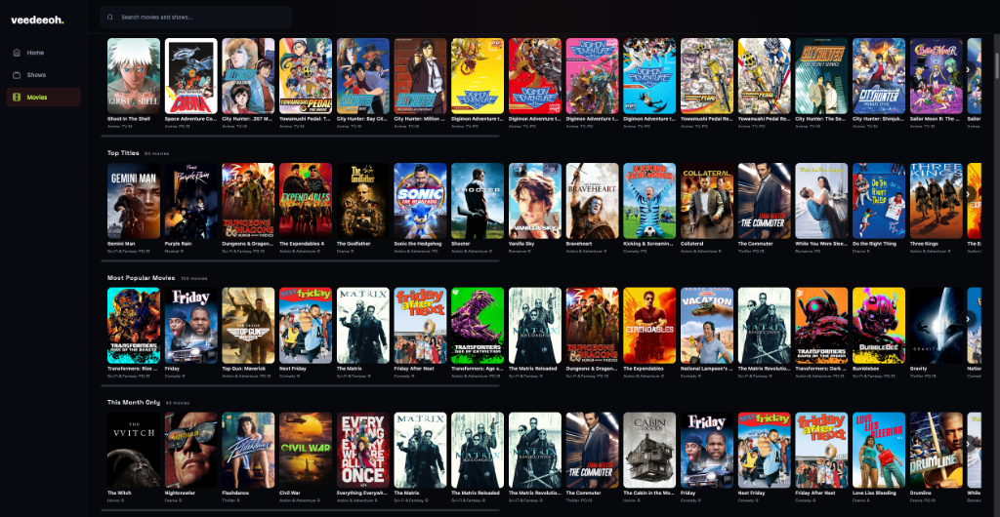
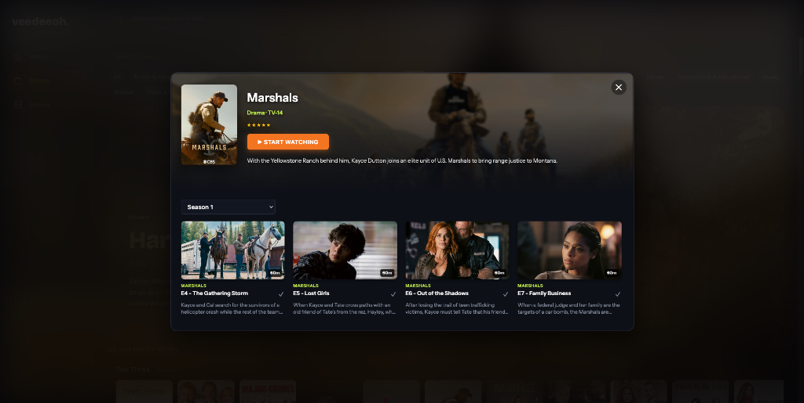

# veedeeoh.

[](https://github.com/ItsCodejac/veedeeoh/actions/workflows/ci.yml)
[](https://opensource.org/licenses/MIT)

**veedeeoh.** is a self-hosted Video-on-Demand (VOD) streaming application for movies, TV series, and classic cinema across your devices. Built with Hono (TypeScript), Vite, and Docker.



## 🍿 Interface & Features

- 🍿 **VOD Catalog** — Pluto TV movies & TV shows, plus Internet Archive cinema classics
- ▶️ **In-Page Playback** — Native HLS video player with CORS proxying
- ★ **Favorites & History** — Local JSON persistence for user state
- 🐳 **Self-Hosting** — Docker and Docker Compose support out of the box

### Movies & Shows Catalog Grid


### Episode & Series Details Modal


### Native HLS Video Player


---

## 🐳 Self-Hosting (Docker Compose)

To run **veedeeoh.** with Docker Compose:

```yaml
version: '3.8'

services:
  veedeeoh:
    build: .
    container_name: veedeeoh
    ports:
      - "8321:8321"
    environment:
      - PORT=8321
      - NODE_ENV=production
    volumes:
      - veedeeoh_data:/root/.local/share/tvlc
    restart: unless-stopped

volumes:
  veedeeoh_data:
```

Run:
```sh
docker compose up -d
```

Access `http://localhost:8321` (or `http://<your-server-ip>:8321`) in your browser.

---

## 💻 Running from Source

Requires [Node.js 20+](https://nodejs.org/).

### 1. Build Frontend
```sh
cd frontend
npm install
npm run build
```

### 2. Start Backend Server
```sh
cd ../backend
npm install
npm run start
```

Access `http://localhost:8321` in your browser.

---

## Environment Variables

| Variable | Default | Description |
| --- | --- | --- |
| `PORT` | `8321` | HTTP server port |
| `SUPABASE_URL` | *(Optional)* | Supabase Auth URL |
| `SUPABASE_ANON_KEY` | *(Optional)* | Supabase Anonymous Key |

---

## Development

- **Backend** (Hono / Node.js):
  ```sh
  cd backend
  npm run dev   # auto-reloading dev server
  ```

- **Frontend** (Vite / TypeScript):
  ```sh
  cd frontend
  npm run dev   # dev server on :5173 with backend proxying
  ```

---

## Credits

Content indexed from public video sources including Pluto TV and Internet Archive.
